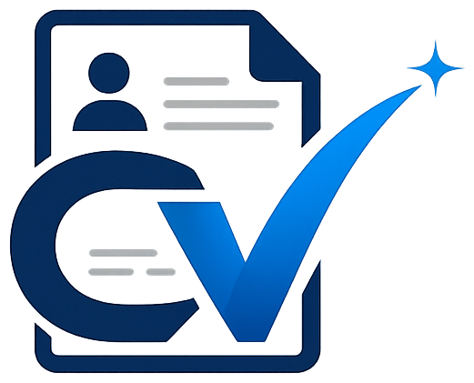

<div align="center">

# CVNova ✨

**Build a Professional CV in Minutes — Free CV Builder for Sri Lanka 🇱🇰**




</div>

---

## 🚀 What is CVNova?

CVNova is a **CV builder web application** that lets anyone create a professional CV in minutes. Pick a beautiful template, fill in your details, and download a ready-to-send **A4 PDF** — no design skills needed!

Inspired by platforms like CVMe.lk, built with **Laravel** and a clean **dark blue theme** derived from the brand logo.

## ✨ Features

| Feature | Description |
|---|---|
| 🎨 **5 Premium Templates** | Classic, Modern, Minimal, Creative, Elegant |
| 👁 **Live Preview** | CV updates in real-time as you type |
| 📄 **A4 Balanced** | Exact A4 sizing (794×1123px), fit indicator |
| ⬇ **One-click PDF** | Print-optimized, exact 210mm×297mm output |
| 🔍 **Zoom Control** | Fit-width / 100% / 80% / 60% preview |
| 🏷 **Dynamic Sections** | Skills, Experience, Education, Languages |
| 📱 **Responsive** | Works on desktop, tablet & mobile |
| 🖼 **Brand Logo** | Custom transparent PNG logo + favicon |

## 🖥 Templates

| Template | Style | Best For |
|---|---|---|
| **Classic** | Serif, ATS-friendly | Banks, Government, Traditional jobs |
| **Modern** | Dark sidebar + skill bars | IT, Engineering |
| **Minimal** | Clean whitespace | Design, Startups |
| **Creative** | Gold band header | Marketing, Creative roles |
| **Elegant** | Monogram, premium serif | Executive, Management |

## 🛠 Tech Stack

- **Backend:** Laravel 13, PHP 8.3
- **Database:** SQLite (default, zero setup)
- **Frontend:** Blade templates, vanilla JS, custom CSS (no build step needed)
- **Assets:** Plain CSS/JS in `public/` (no Vite/npm required to run)

## 📦 Installation

```bash
# 1. Install dependencies
composer install

# 2. Set up environment
cp .env.example .env
php artisan key:generate

# 3. Create SQLite database & migrate
touch database/database.sqlite
php artisan migrate

# 4. Start the server
php artisan serve
```

Then open **http://127.0.0.1:8000** 🎉

## 🧭 Routes

| Route | Description |
|---|---|
| `/` | Landing page (hero, features, templates, pricing) |
| `/templates` | Template gallery |
| `/editor` | CV Builder with live A4 preview |
| `/editor/{template}` | Open builder with a specific template (t1–t5) |

## 📁 Project Structure

```
├── app/Http/Controllers/   # Home, Templates, Editor controllers
├── resources/views/        # Blade layouts, home, templates, editor
├── public/
│   ├── css/app.css         # Full design system (dark blue theme)
│   ├── js/app.js           # Editor logic, CV renderers, A4 fit check
│   └── img/logo.png        # Brand logo (transparent)
├── index.html              # Standalone preview (double-click to open)
└── routes/web.php
```

## 🖼 Standalone Preview

`index.html` in the project root is a **fully standalone version** — open it directly in any browser to preview the landing page, templates and editor without running PHP.

## 📄 License

MIT — free to use, modify and share. Made with 💙 in Sri Lanka.
